# VeloraKart - Django E-commerce Platform

A full-featured e-commerce web application built with Django, offering a complete online shopping experience with user authentication, product management, shopping cart, and order processing.

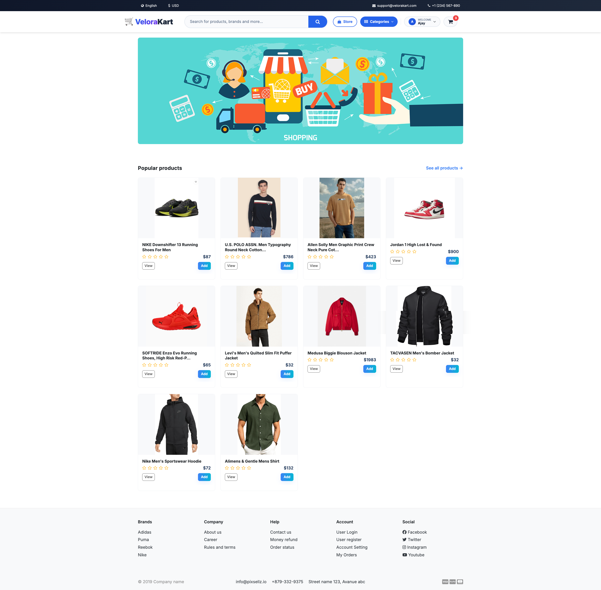

## 🚀 Features

### User Authentication & Account Management
- **User Registration & Login**: Secure user authentication with email verification
- **User Profile Management**: Edit profile information, upload profile pictures
- **Password Management**: Change password functionality with validation
- **User Dashboard**: Personalized dashboard for order history and account management

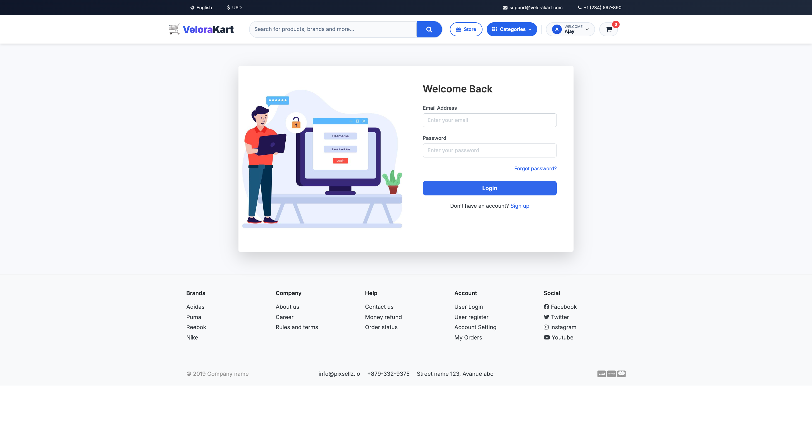
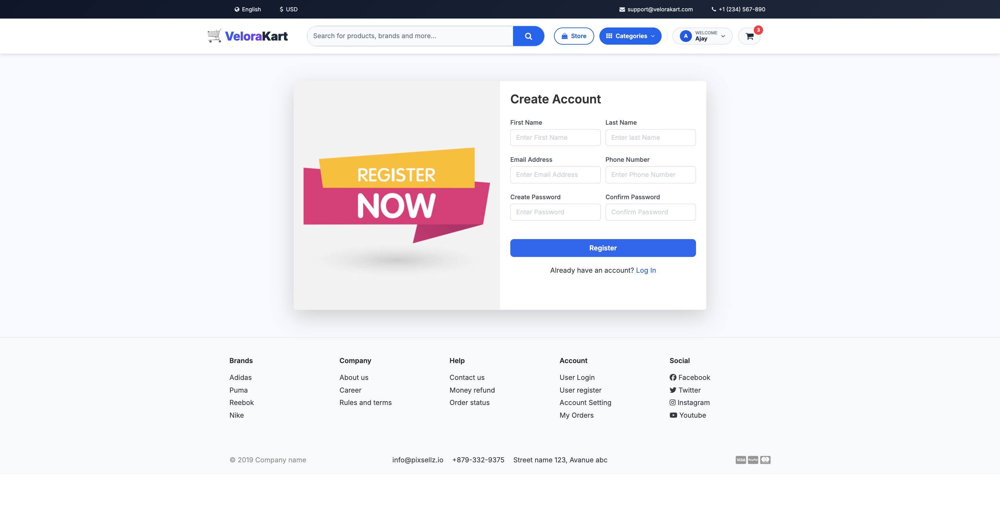
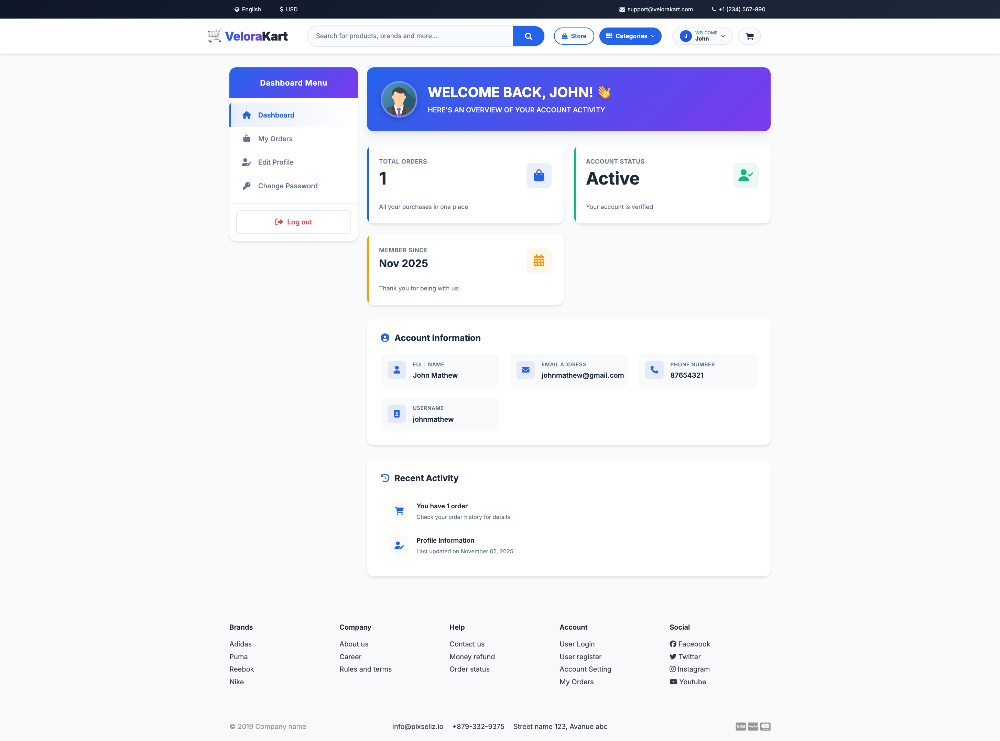
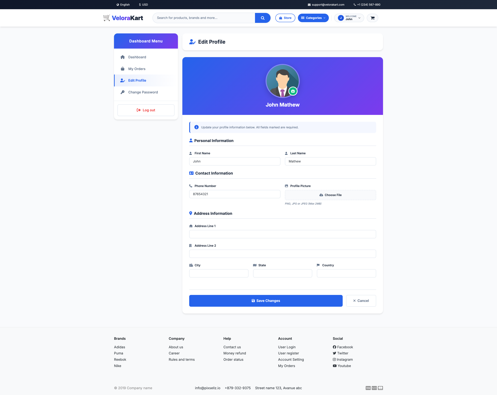
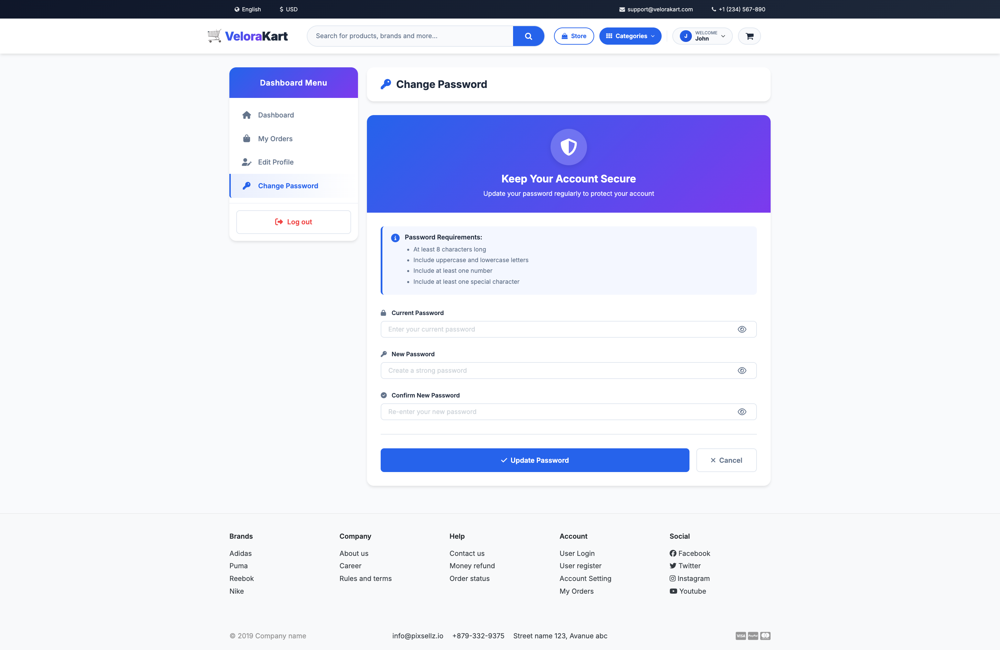

### Product Management
- **Product Catalog**: Browse products with detailed information
- **Category-based Organization**: Products organized by categories
- **Product Variations**: Support for different sizes and colors
- **Product Gallery**: Multiple images per product
- **Product Reviews & Ratings**: Customer review system with star ratings
- **Search & Filter**: Advanced product search and filtering options

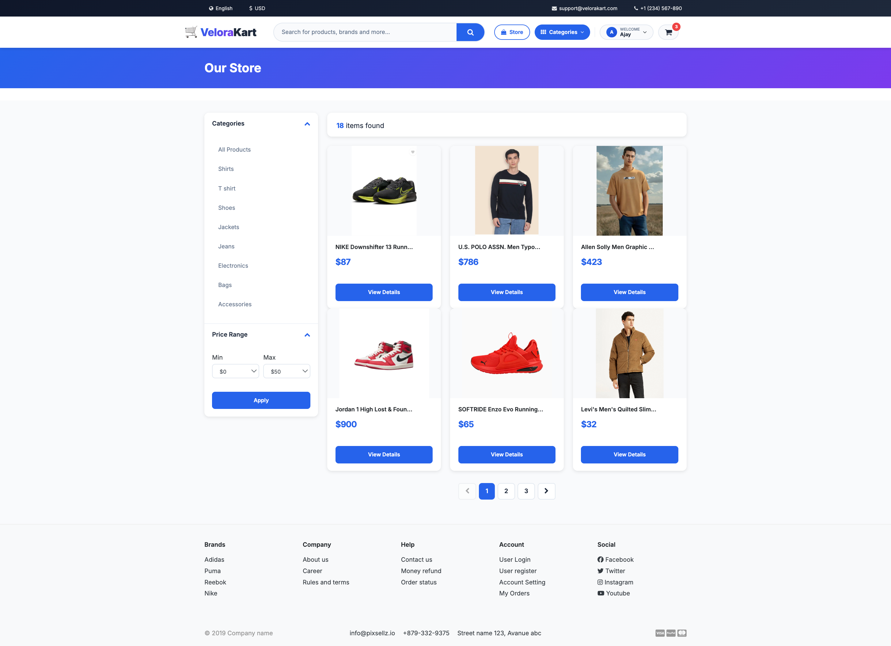
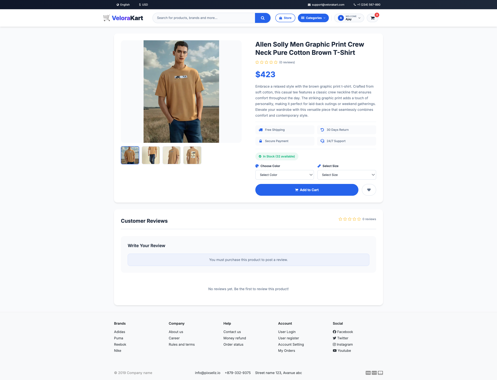

### Shopping Cart & Checkout
- **Shopping Cart**: Add/remove products with quantity management
- **Product Variations**: Select size and color options
- **Cart Persistence**: Cart items saved across sessions
- **Secure Checkout**: Multi-step checkout process
- **Order Summary**: Detailed order breakdown with tax calculations

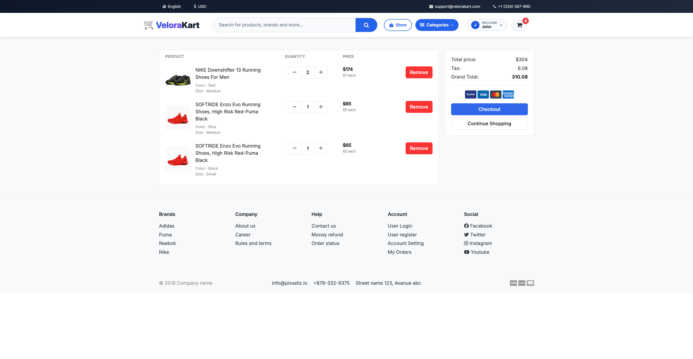
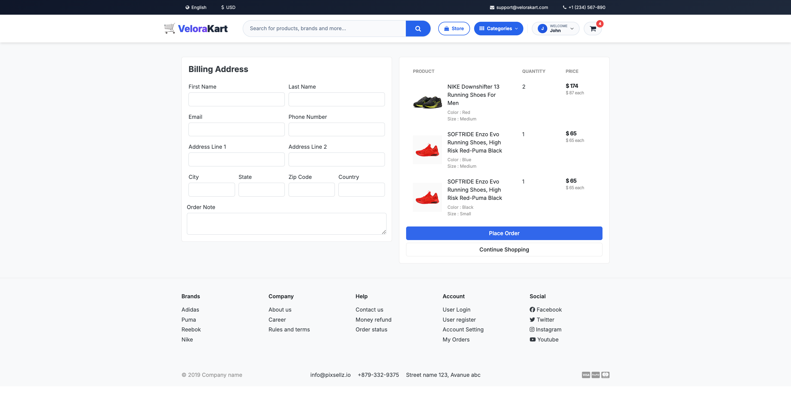


### Payment & Order Management
- **Payment Integration**: PayPal payment gateway integration
- **Order Processing**: Complete order lifecycle management
- **Order History**: View past orders and order details
- **Invoice Generation**: PDF invoice generation for orders
- **Order Status Tracking**: Track order status from placement to delivery

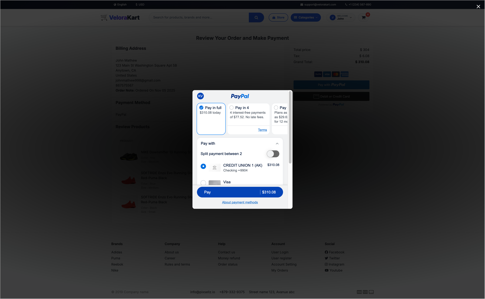
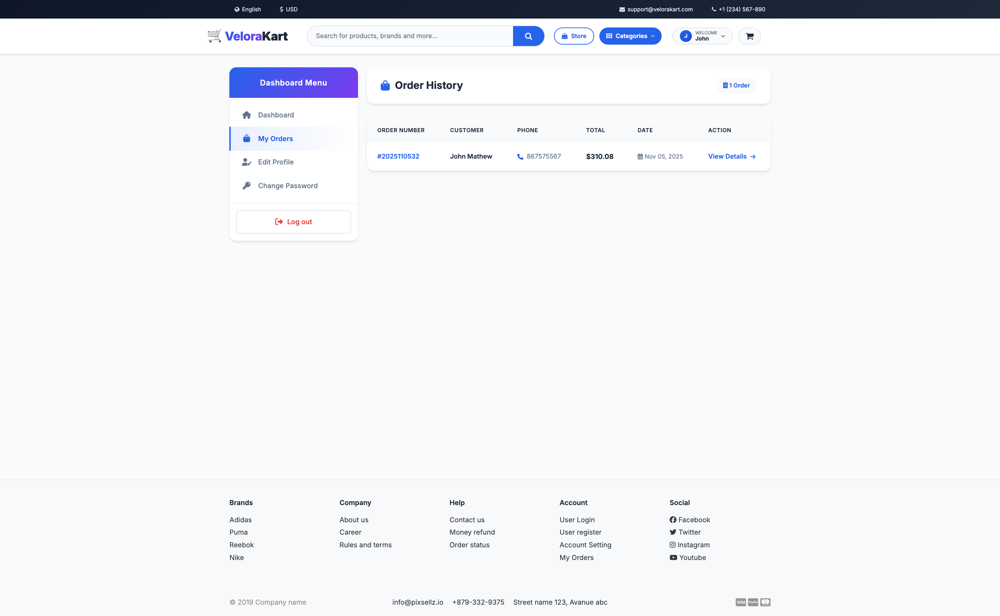
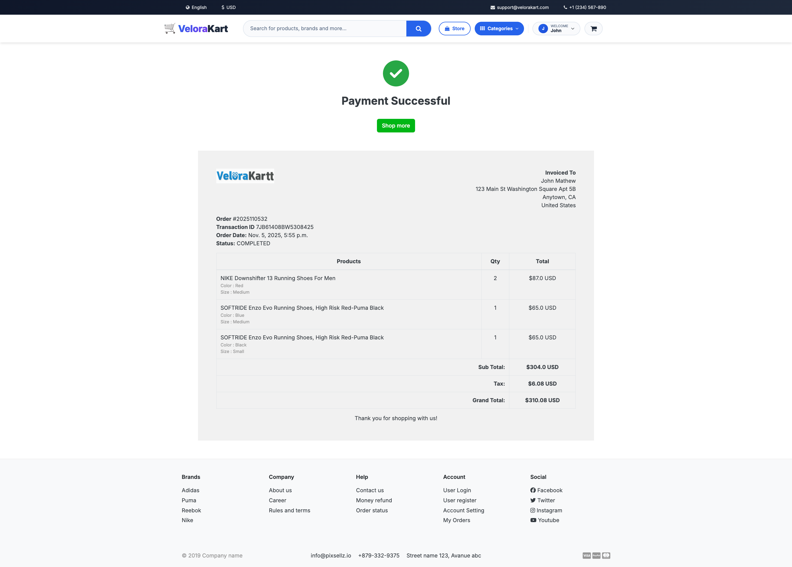

### Admin Features
- **Product Management**: Add, edit, delete products
- **Category Management**: Organize products by categories
- **Order Management**: Process and track orders
- **User Management**: Manage customer accounts
- **Inventory Management**: Track stock levels

## 📋 Requirements

### System Requirements
- Python 3.8+
- Django 5.2.5
- SQLite (default) or PostgreSQL/MySQL
- Git

### Python Dependencies
```
django==5.2.5
requests==2.31.0
python-decouple==3.8
```

## 📁 Project Structure

```
ecommerce-kart/
│
├── VeloraKart/                 # Main Django project directory
│   ├── velorakart/            # Project settings and configuration
│   │   ├── __init__.py
│   │   ├── settings.py        # Django settings
│   │   ├── urls.py           # Main URL configuration
│   │   ├── views.py          # Main views
│   │   ├── wsgi.py           # WSGI configuration
│   │   └── asgi.py           # ASGI configuration
│   │
│   ├── accounts/              # User authentication and profiles
│   │   ├── models.py         # User and UserProfile models
│   │   ├── views.py          # Authentication views
│   │   ├── admin.py          # Admin configuration
│   │   └── migrations/       # Database migrations
│   │
│   ├── category/              # Product categories
│   │   ├── models.py         # Category model
│   │   ├── views.py          # Category views
│   │   ├── context_processor.py  # Menu context processor
│   │   └── migrations/       # Database migrations
│   │
│   ├── store/                 # Products and inventory
│   │   ├── models.py         # Product, Variation, ReviewRating models
│   │   ├── views.py          # Product views
│   │   ├── admin.py          # Product admin
│   │   └── migrations/       # Database migrations
│   │
│   ├── cart/                  # Shopping cart functionality
│   │   ├── models.py         # Cart and CartItem models
│   │   ├── views.py          # Cart management views
│   │   ├── context_processors.py  # Cart counter processor
│   │   └── migrations/       # Database migrations
│   │
│   ├── orders/                # Order processing
│   │   ├── models.py         # Order, Payment, OrderProduct models
│   │   ├── views.py          # Order processing views
│   │   ├── admin.py          # Order admin
│   │   └── migrations/       # Database migrations
│   │
│   ├── templates/             # HTML templates
│   │   ├── base.html         # Base template
│   │   ├── home.html         # Home page template
│   │   ├── accounts/         # Account-related templates
│   │   ├── store/            # Store templates
│   │   ├── cart/             # Cart templates
│   │   └── orders/           # Order templates
│   │
│   ├── static/                # Static files (CSS, JS, Images)
│   │   ├── css/              # Stylesheets
│   │   ├── js/               # JavaScript files
│   │   └── images/           # Static images
│   │
│   ├── media/                 # User-uploaded files
│   │   ├── photos/           # Product and category images
│   │   └── userprofile/      # User profile pictures
│   │
│   ├── screenshots/           # Application screenshots
│   ├── manage.py             # Django management script
│   ├── requirements.txt      # Python dependencies
│   ├── db.sqlite3           # SQLite database
│   ├── .env                 # Environment variables (not in repo)
│   └── .env-sample          # Environment variables template
│
├── .gitignore               # Git ignore file
├── LICENSE                  # Project license
└── README.md               # This file
```

## 🛠️ Installation and Setup

### 1. Clone the Repository
```bash
git clone https://github.com/yourusername/ecommerce-kart.git
cd ecommerce-kart/VeloraKart
```

### 2. Create Virtual Environment
```bash
# Create virtual environment
python -m venv .venv

# Activate virtual environment
# On macOS/Linux:
source .venv/bin/activate
# On Windows:
.venv\Scripts\activate
```

### 3. Install Dependencies
```bash
pip install -r requirements.txt
```

### 4. Environment Configuration
```bash
# Copy environment template
cp .env-sample .env

# Edit .env file with your configuration
nano .env
```

Configure the following environment variables in `.env`:
```env
SECRET_KEY=your-secret-key-here
DEBUG=True
EMAIL_BACKEND=django.core.mail.backends.smtp.EmailBackend
EMAIL_HOST=smtp.gmail.com
EMAIL_PORT=587
EMAIL_USE_TLS=True
EMAIL_HOST_USER=your-email@gmail.com
EMAIL_HOST_PASSWORD=your-app-password
```

### 5. Database Setup
```bash
# Apply migrations
python manage.py makemigrations
python manage.py migrate

# Create superuser
python manage.py createsuperuser
```

### 6. Collect Static Files
```bash
python manage.py collectstatic
```

### 7. Run Development Server
```bash
python manage.py runserver
```

Visit `http://127.0.0.1:8000` to access the application.

### 8. Admin Access
Visit `http://127.0.0.1:8000/admin` and log in with your superuser credentials to manage:
- Products and Categories
- User Accounts
- Orders and Payments
- Reviews and Ratings

## 🗄️ Database Schema

### Core Models

#### User Management
```python
# accounts.models.Account
- email (EmailField, unique, primary key)
- username (CharField, unique)
- first_name (CharField)
- last_name (CharField)
- phone_number (CharField)
- is_active (BooleanField)
- is_admin (BooleanField)
- date_joined (DateTimeField)

# accounts.models.UserProfile
- user (OneToOneField to Account)
- address_line_1 (CharField)
- address_line_2 (CharField)
- profile_picture (ImageField)
- city, state, country (CharField)
```

#### Product Management
```python
# category.models.Category
- category_name (CharField, unique)
- slug (SlugField, unique)
- description (CharField)
- cat_image (ImageField)

# store.models.Product
- product_name (CharField, unique)
- slug (SlugField, unique)
- description (TextField)
- price (IntegerField)
- images (ImageField)
- stock (IntegerField)
- is_available (BooleanField)
- category (ForeignKey to Category)
- created_date, modified_date (DateTimeField)

# store.models.Variation
- product (ForeignKey to Product)
- variation_category (CharField: color/size)
- variation_value (CharField)
- is_active (BooleanField)

# store.models.ReviewRating
- product (ForeignKey to Product)
- user (ForeignKey to Account)
- subject (CharField)
- review (TextField)
- rating (FloatField)
- status (BooleanField)
```

#### Shopping & Orders
```python
# cart.models.Cart
- cart_id (CharField)
- date_added (DateField)

# cart.models.CartItem
- user (ForeignKey to Account)
- product (ForeignKey to Product)
- variations (ManyToManyField to Variation)
- cart (ForeignKey to Cart)
- quantity (IntegerField)
- is_active (BooleanField)

# orders.models.Payment
- user (ForeignKey to Account)
- payment_id (CharField)
- payment_method (CharField)
- amount_paid (CharField)
- status (CharField)

# orders.models.Order
- user (ForeignKey to Account)
- payment (ForeignKey to Payment)
- order_number (CharField)
- first_name, last_name (CharField)
- email (EmailField)
- address_line_1, address_line_2 (CharField)
- country, state, city (CharField)
- order_total (FloatField)
- tax (FloatField)
- status (CharField: New/Accepted/Completed/Cancelled)
- is_ordered (BooleanField)

# orders.models.OrderProduct
- order (ForeignKey to Order)
- payment (ForeignKey to Payment)
- user (ForeignKey to Account)
- product (ForeignKey to Product)
- variations (ManyToManyField to Variation)
- quantity (IntegerField)
- product_price (FloatField)
- ordered (BooleanField)
```

### Database Relationships
- **One-to-One**: Account ↔ UserProfile
- **One-to-Many**: 
  - Category → Products
  - Product → Variations
  - Product → Reviews
  - Account → Orders
  - Order → OrderProducts
- **Many-to-Many**: 
  - CartItem ↔ Variations
  - OrderProduct ↔ Variations

## 🔧 Configuration

### Email Configuration
For email functionality (user verification, order confirmations), configure SMTP settings in `.env`:
```env
EMAIL_BACKEND=django.core.mail.backends.smtp.EmailBackend
EMAIL_HOST=smtp.gmail.com
EMAIL_PORT=587
EMAIL_USE_TLS=True
EMAIL_HOST_USER=your-email@gmail.com
EMAIL_HOST_PASSWORD=your-app-password
```

### Payment Gateway
Currently integrated with PayPal. To configure:
1. Create PayPal developer account
2. Get API credentials
3. Configure in your payment views

### Media Files
User-uploaded files are stored in:
- `media/photos/products/` - Product images
- `media/photos/categories/` - Category images
- `media/userprofile/` - User profile pictures

## 🚀 Deployment

### Production Settings
1. Set `DEBUG=False` in production
2. Configure allowed hosts
3. Use PostgreSQL or MySQL database
4. Set up static file serving (AWS S3, Cloudinary)
5. Configure email service (SendGrid, Mailgun)
6. Set up SSL certificates

### Docker Deployment (Optional)
Create `Dockerfile` and `docker-compose.yml` for containerized deployment.

## 🤝 Contributing

1. Fork the repository
2. Create your feature branch (`git checkout -b feature/AmazingFeature`)
3. Commit your changes (`git commit -m 'Add some AmazingFeature'`)
4. Push to the branch (`git push origin feature/AmazingFeature`)
5. Open a Pull Request

## 📝 License

This project is licensed under the MIT License - see the [LICENSE](LICENSE) file for details.


## 🙏 Acknowledgments

- Django framework for robust web development
- Bootstrap for responsive UI components
- PayPal for payment processing integration
- Font Awesome for icons

---

**VeloraKart** - Building the future of e-commerce, one cart at a time! 🛒✨